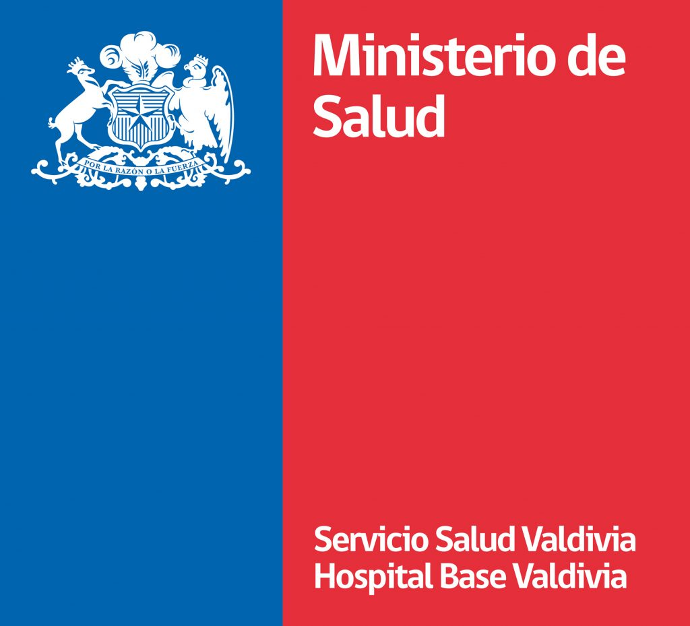

# Urgency demand for the Hospital Base Valdivia

The following table presents the analysis of the demand in the emergency unit for the base hospital in the city of Valdivia, located in the Los Ríos Region in Chile.

For this we work with the information provided by the Department of Health Statistics and Information belonging to the Ministry of Health.

In the following link you can access the latest version of the board -> <https://anastasiarebolledo.shinyapps.io/Dash_HBV_Emergency_unit/>
